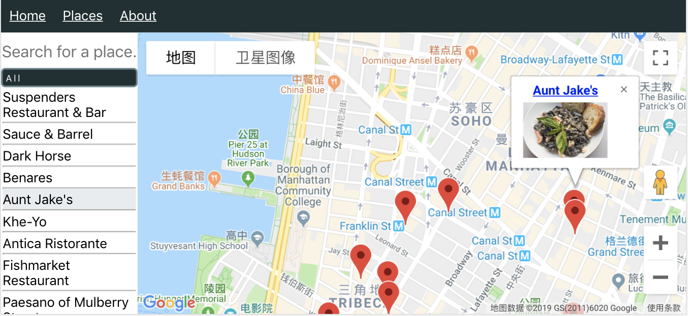

# React Google Map

[](https://www.npmjs.com/package/@lucifer1004/react-google-map)
[](https://opensource.org/licenses/MIT)
[](https://codecov.io/gh/lucifer1004/react-google-map)
[](https://codebeat.co/projects/github-com-lucifer1004-react-google-map-master)

Easier Google Map Integration for React projects.

## Why a new package

There has been similar packages such as
[tomchentw/react-google-maps](https://github.com/tomchentw/react-google-maps),
[google-map-react/google-map-react](https://github.com/google-map-react/google-map-react),
[fullstackreact/google-maps-react](https://github.com/fullstackreact/google-maps-react),
so why bother writing a new library?

The aim is to make an easier-to-use Google Map library for React users,
empowered by React's latest features.

## Prerequisites

- node
- npm or yarn
- a valid Google Map API key

## Basic usage

```javascript
import {
  GoogleMapProvider,
  HeatMap,
  InfoWindow,
  MapBox,
  Marker,
  Polygon,
} from '@lucifer1004/react-google-map'

// In your component
return (
  <GoogleMapProvider>
    <MapBox
      apiKey="GOOGLE_MAP_API_KEY"
      opts={{
        center: {lat: 39, lng: 116},
        noClear: true,
        zoom: 14,
      }}
      useDrawing
      useGeometry
      usePlaces
      useVisualization
      onCenterChanged={() => {
        console.log('The center of the map has changed.')
      }}
    />
    <Marker
      id="marker"
      opts={{
        draggable: true,
        label: 'hello',
        position: {lat: 39, lng: 116},
      }}
    />
    <InfoWindow
      opts={{
        content: 'This is an info window',
        position: {lat: 39.01, lng: 115.99},
      }}
      visible
    />
    <Polygon
      id="polygon"
      paths={[
        {lat: 38.98, lng: 116.01},
        {lat: 38.98, lng: 116.03},
        {lat: 38.99, lng: 116.03},
      ]}
      visible
      opts={{
        strokeColor: 'cyan',
      }}
    />
    <HeatMap
      data={[
        {lat: 38.982, lng: 116.037},
        {lat: 38.982, lng: 116.035},
        {lat: 38.985, lng: 116.047},
        {lat: 38.985, lng: 116.045},
      ]}
    />
    <OverlayView position={{lat: 39, lng: 116}}>
      <h2>{`⚑ This is a custom overlay 🙌`}</h2>
    </OverlayView>
  </GoogleMapProvider>
)
```

Let's break it up.

### GoogleMapProvider

- You need to wrap your components within `GoogleMapProvider`, so that they will
  have access to the global state and work fluently.

Under the hood, `React.Context` is used.

Besides `GoogleMapProvider`, `GoogleMapConsumer` and `GoogleMapContext` are also
exported. You can choose to use the consumer manner, or use `useContext` hook,
to get access to the context contents in your custom components.

> #### What's inside the context?
>
> Currently, the context has two properties: `state` and `dispatch`. As the
> names suggest, `state` stores the context state, and `dispatch` is the reduce
> function.
>
> `state` has 3 properties:
>
> - `map`, which is a reference to the `google.maps.Map` instance.
> - `objects`, which is a `Map` storing all `google.maps.MVCObject` instances as
>   `id`-`object` pairs
> - `service`, which is a reference to the `google.maps.places.PlaceService`
>   instance. It will be automatically instantiated when `usingPlaces` is `true`
>   in `MapBox`.
>
> Users can manipulate Google Map objects directly via these properties.

### MapBox

- `MapBox` is a wrapper of a `google.maps.Map` instance.
- There can only be one `MapBox` within `GoogleMapProvider`. If you want to have
  multiple maps, you can handle them with multiple providers.
- Google Map options should be placed in `opts`.

### Marker

- `Marker` is a wrapper of a `google.maps.Marker` instance.
- Google Map options should be placed in `opts`.
- The `id` prop is required and must be unique.

### InfoWindow

- `InfoWindow` is a wrapper of a `google.maps.InfoWindow` instance.
- `InfoWindow` props should be placed in `opts`, however, `visible` is addressed
  as an exclusion, for easier use.

### Polygon

- `Polygon` is a wrapper of a `google.maps.Polygon` instance.
- `paths` and `visible` are left out of the `opts` prop.
- The `id` prop is required and must be unique.

### HeatMap

- `HeatMap` is a wrapper of a `google.maps.visualization.HeatmapLayer` instance
- `useVisualization` of the `MapBox` instance must be `true`
- `data` prop is an array of `{lat, lng, weight?}`

### OverlayView

- `OverlayView` is a wrapper of a `google.maps.OverlayView` instance. You can
  overlay a custom DOM element on the map with this component.
- `position` prop must be given, which is `google.maps.LatLngLiteral`, so that
  `OverlayView` can be located
- `pane` prop defines in which pane this `OverlayView` will be rendered, default
  is `"overlayMouseTarget"`
  ([ref](https://developers.google.com/maps/documentation/javascript/reference/overlay-view#MapPanes))

## Advanced usage

Instead of using the pre-designed components, you can also use the exported
hooks `useGoogleAPI`, `useGoogleListeners` in your own components.

## See the examples

```sh
git clone https://github.com/lucifer1004/react-gmap
cd react-gmap
yarn install
```

### Storybook

The best way to learn how to use this package is to use the storybook.

```sh
yarn storybook
```

### App

You can also run the example app. Before running it locally, you should copy the
sample dotenv file, and fill in your Google Map API key to replace the
placeholder.

```sh
cp .env.sample .env
```

Then you can run the example project by

```sh
yarn start
```

## Projects using this package

### Boycott [github](https://github.com/lucifer1004/boycott)|[site](https://boycott.gabriel-wu.com)

This app combines Google Map API and Yelp API, helping users search nearby
businesses.


